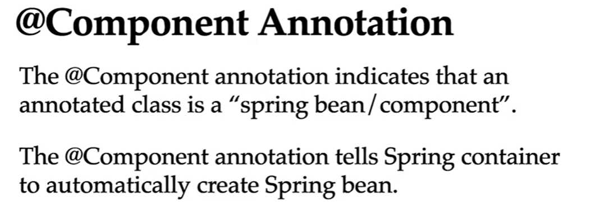
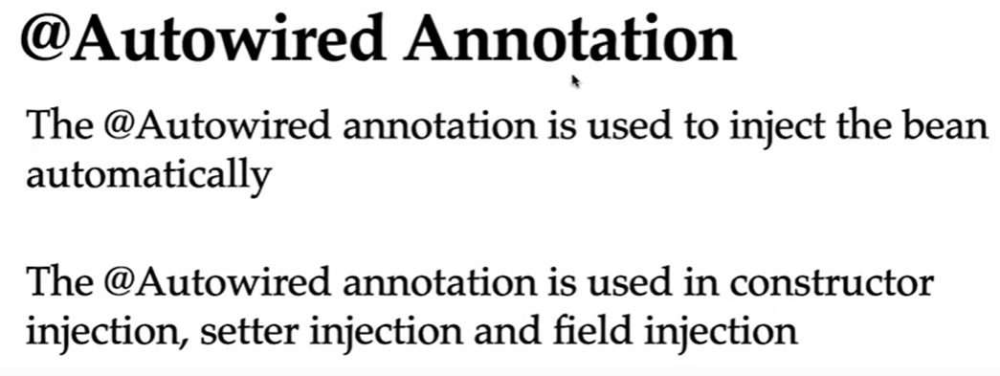
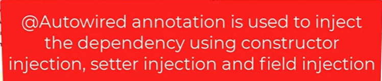
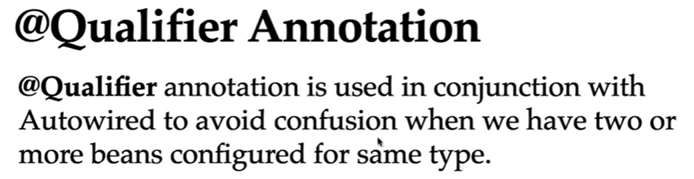
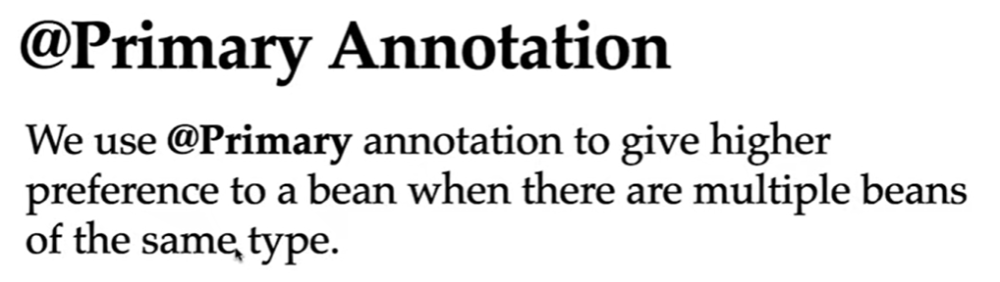
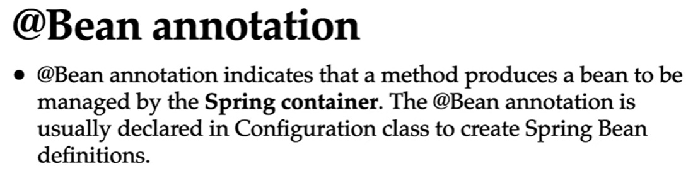
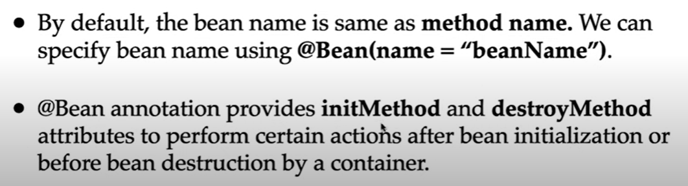
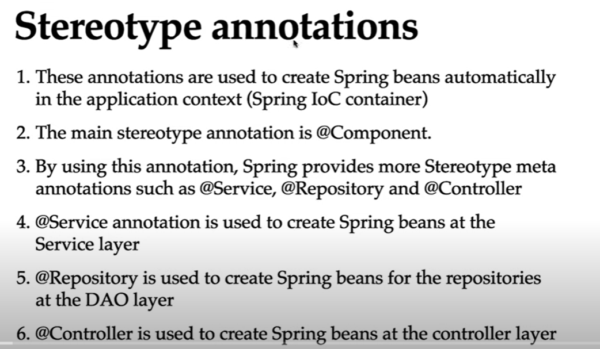
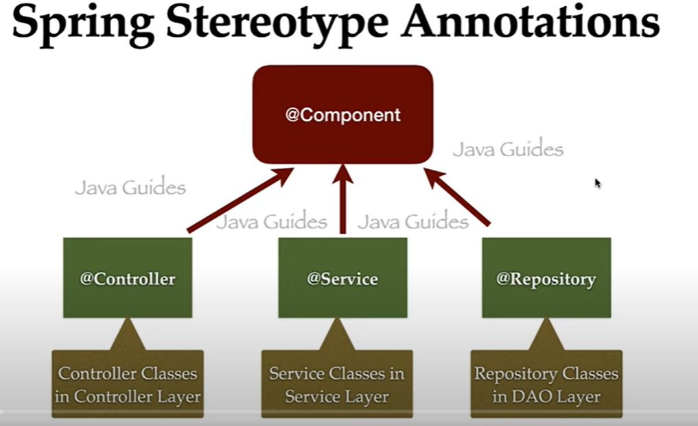

<h1>Spring boot Annotations</h1>
<h2>@Component</h2>

<h2>@Autowired</h2>

<h2>@Qualifier</h2>

<h2>@Primary</h2>

<h2>@Bean</h2>

<h1>Stereotype Annotations</h1>

<h2>@Controller</h2>
<h2>@Service</h2>
<h2>@Repository</h2>

